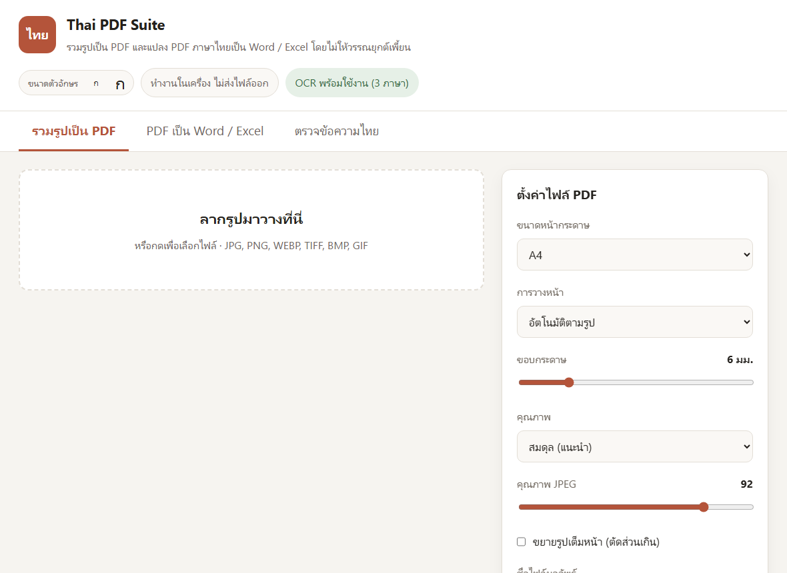
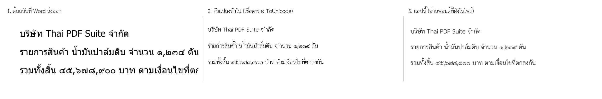
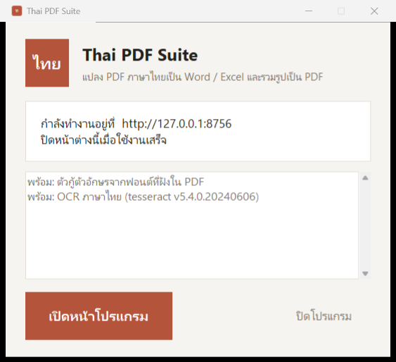
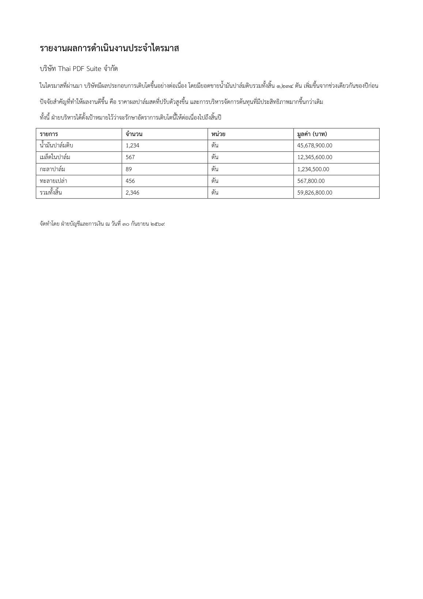

# Thai PDF Suite

แอปในเครื่องสำหรับ **รวมรูปเป็น PDF** และ **แปลง PDF ภาษาไทยเป็น Word / Excel**
โดยไม่ให้วรรณยุกต์เพี้ยนและไม่ให้ตัวอักษรหาย

ไฟล์ทุกไฟล์ถูกประมวลผลในเครื่องของคุณเท่านั้น ไม่มีการส่งออกไปที่ใด

### [⬇ ดาวน์โหลดตัวติดตั้งสำหรับ Windows](https://github.com/jakrapolgod/thai-pdf-suite/releases/latest)

ไฟล์เดียวจบ ไม่ต้องมี Python ไม่ต้องขอสิทธิ์ผู้ดูแลเครื่อง · Windows 10 ขึ้นไป 64 บิต



---

## ทำไมต้องมีแอปนี้

ตัวแปลง PDF ทั่วไปอ่านข้อความจากตารางแปลงกลับ (ToUnicode) ที่ฝังอยู่ใน PDF
ซึ่ง **Word และ Excel บน Windows เขียนตารางนี้ผิดเป็นประจำกับภาษาไทย**
หน้าจอแสดงถูกทุกตัว แต่พอคัดลอกข้อความออกมากลับเพี้ยน และมองด้วยตาไม่เห็น



แอปนี้ไม่เชื่อตารางนั้น แต่เปิดไฟล์ฟอนต์ที่ฝังอยู่ใน PDF ขึ้นมาอ่านชื่อ glyph โดยตรง
ซึ่งตรงกับสิ่งที่ถูกวาดออกมาจริง รายละเอียดอยู่ในหัวข้อ
[ปัญหาภาษาไทยที่แอปแก้ให้](#ปัญหาภาษาไทยที่แอปแก้ให้) ข้อ 9

---

## เริ่มใช้งาน

### แบบติดตั้ง (สำหรับใช้งานจริง)

ดาวน์โหลด `ThaiPDFSuite-Setup-x.x.exe` จาก
[หน้า Releases](https://github.com/jakrapolgod/thai-pdf-suite/releases/latest)
แล้วกดถัดไปจนจบ ไม่ต้องมี Python ในเครื่อง ไม่ต้องขอสิทธิ์ผู้ดูแลเครื่อง

* ติดตั้งลง `%LOCALAPPDATA%\Programs\Thai PDF Suite`
* เปิดใช้งานจากเมนู Start ชื่อ **Thai PDF Suite**
* ถอนการติดตั้งได้จาก การตั้งค่า > แอป หรือจากทางลัดในเมนู Start
* ตอนติดตั้งเลือกได้ว่าจะเอาข้อมูลภาษาไทยสำหรับอ่านไฟล์สแกนด้วยหรือไม่ (ราว 33 MB)

ตัวติดตั้งก๊อปปี้ไปลงเครื่องอื่นได้เลย ไฟล์เดียวจบ

เปิดโปรแกรมแล้วจะได้หน้าต่างบอกสถานะ และเบราว์เซอร์จะเปิดหน้าโปรแกรมให้เอง



### แบบรันจากซอร์ส (สำหรับแก้ไขโปรแกรม)

```bash
python -m pip install -r requirements.txt
python app.py
```

เบราว์เซอร์จะเปิดขึ้นเอง หรือกดไฟล์ `run.bat` บน Windows ก็ได้เหมือนกัน

---

## แอปรับประกันอะไรได้บ้าง

พูดตรง ๆ เพราะเรื่องนี้สำคัญกว่าคำโฆษณา

| ประเภทไฟล์ | ผลลัพธ์ | ตรวจสอบได้ไหม |
|---|---|---|
| PDF ที่มีชั้นข้อความ (ส่งออกจาก Word, Excel, ระบบบัญชี, เว็บ) | **ตรงทุกตัวอักษร** | ได้ แอปเปิดไฟล์ผลลัพธ์อ่านกลับแล้วเทียบทีละรหัสอักขระ |
| PDF ที่เป็นภาพสแกน | ต้องใช้ OCR ซึ่ง**อ่านผิดได้** | บอกค่าความมั่นใจรายคำ และยกคำที่น่าสงสัยมาให้ตรวจ |

ไม่มีเอนจิน OCR ใดในโลกรับประกัน 100% กับภาษาไทย แอปนี้จึงไม่กล้ารับประกันแทน
แต่จะบอกให้ชัดว่าหน้าไหนมาจาก OCR และคำไหนควรตรวจซ้ำ แทนที่จะส่งข้อความที่อาจผิดออกไปเงียบ ๆ

ภาพนี้คือไฟล์ Word ที่แอปสร้าง เปิดด้วย Microsoft Word ตัวจริงแล้วสั่งพิมพ์กลับเป็น PDF
วรรณยุกต์ สระ ทัณฑฆาต และเลขไทยอยู่ครบถูกตำแหน่งทุกตัว



**ตัวเลขจริงที่วัดได้** จากเอกสารทดสอบ (`tests/test_ocr.py` แปลงหน้าที่รู้ข้อความจริงเป็นภาพล้วน
แล้วให้ OCR อ่านกลับ): ความถูกต้องระดับตัวอักษรราว **65%** พยัญชนะและสระส่วนใหญ่ถูก
แต่**วรรณยุกต์หายหรือผิดค่อนข้างบ่อย** เช่น `น้ำ` กลายเป็น `นำ`, `ทั้งสิ้น` กลายเป็น `ทังสืน`

ที่ต้องระวังที่สุด: เอนจินรายงานค่าความมั่นใจ **93%** ในขณะที่ความถูกต้องจริงคือ 65%
ค่าความมั่นใจของ Tesseract จึงเชื่อไม่ได้กับภาษาไทย ให้ใช้ดูคร่าว ๆ เท่านั้นและอ่านทานผลลัพธ์เสมอ
ถ้างานนั้นผิดไม่ได้ (เอกสารการเงิน สัญญา) ให้หาไฟล์ต้นทางที่มีชั้นข้อความมาแปลงแทน

หน้าจอผลลัพธ์จะขึ้นข้อความต่างกันสามแบบ

* **ตรงกับต้นฉบับทุกตัวอักษร** — ทั้งไฟล์มาจากชั้นข้อความ และตรวจย้อนกลับแล้วตรงหมด
* **ตรงกับข้อความที่อ่านได้ทุกตัว** — ไฟล์ผลลัพธ์ตรงกับสิ่งที่อ่านมา แต่บางหน้ามาจาก OCR
* **พบข้อความไม่ตรงกัน** — พร้อมรายการว่าชิ้นไหนเพี้ยน

---

## ปัญหาภาษาไทยที่แอปแก้ให้

ทั้งหมดนี้คือสาเหตุจริงที่ทำให้ไฟล์แปลงแล้ว "วรรณยุกต์เพี้ยน"
แอปแก้ให้อัตโนมัติ และบันทึกไว้ว่าแก้อะไรไปกี่จุด

**1. สระอำแตกร่าง** — เอกสารเก่าที่พิมพ์ด้วยฟอนต์ยุค TIS-620 เก็บคำว่า `น้ำ`
เป็น `น` + นิคหิต + ไม้โท + สระอา ซึ่ง Word วาดออกมาเป็น `นํ้า` วรรณยุกต์ลอยผิดที่
แอปรวมกลับเป็น `น` + ไม้โท + สระอำ ตามมาตรฐาน

**2. ลำดับสระกับวรรณยุกต์สลับที่** — `ก` + ไม้โท + ไม้หันอากาศ ต้องเป็น
`ก` + ไม้หันอากาศ + ไม้โท ถ้าลำดับผิด ตัวอักษรจะดูปกติบนเครื่องหนึ่งแต่เพี้ยนบนอีกเครื่อง

**3. สระแอแตกเป็นสระเอสองตัว** — `เ` + `เ` ไม่มีทางถูกต้องในภาษาไทย ต้องเป็น `แ`

**4. วรรณยุกต์ลอยหรือเกาะผิดตัว** — เช่น วรรณยุกต์ไปเกาะสระหน้า `เ่ก` แทนที่จะเป็น `เก่`

**5. ช่องว่างปลอมกลางคำ** — PDF จำนวนมากวาง glyph ไทยทีละตัว ตัวแปลงทั่วไปจึงได้
`ก า ร ป ร ะ ชุ ม` แอปนี้วัดระยะห่างจริงของแต่ละ glyph แล้วตัดสินใจเองว่าตรงไหนคือช่องว่างจริง

**6. คำถูกผ่าตอนต่อบรรทัด** — ภาษาไทยตัดบรรทัดกลางคำได้โดยไม่มีเครื่องหมายใด ๆ
ถ้าต่อบรรทัดแล้วใส่ช่องว่างทุกครั้ง คำจะถูกผ่าเป็นสองคำ แอปจึงต่อแบบไม่มีช่องว่าง
เมื่อรอยต่อเป็นอักษรไทยทั้งสองฝั่ง

**7. ข้อความถูกถอดรหัสผิดชุดตัวอักษร** — ไบต์ UTF-8 ที่ถูกอ่านเป็น latin-1 หรือ cp874
แอปตรวจจับและเข้ารหัสกลับให้ โดยยอมรับผลก็ต่อเมื่อซ่อมแล้วได้อักษรไทยจริง

**8. ฟอนต์ฝั่ง complex script ในไฟล์ Word** — Word จัดภาษาไทยเป็น complex script
ซึ่งใช้ค่าฟอนต์คนละชุดกับอักษรละติน ถ้าตั้งแค่ `w:ascii` แต่ไม่ตั้ง `w:cs`
Word จะเลือกฟอนต์เองสำหรับอักษรไทย ผลคือวรรณยุกต์ลอยผิดตำแหน่งทั้งที่รหัสอักขระถูกต้องทุกตัว
แอปตั้งครบทั้ง `w:cs`, `w:szCs`, `w:bCs`, `w:iCs` และประกาศภาษา `th-TH`

**9. ตารางแปลงกลับเป็นข้อความของ PDF เขียนผิด** — ข้อนี้ร้ายที่สุดและมองไม่เห็นด้วยตา
เพราะหน้าจอแสดงผลถูกต้องทุกตัว แต่ข้อความที่คัดลอกออกมากลับผิด
พบจริงจากการทดสอบกับ Office บนเครื่องนี้

* **Word + Tahoma / Angsana New** แมป glyph ของสระอากลับเป็นรหัสของสระอำทั้งหมด
  และแมปนิคหิตเป็นช่องว่าง ทำให้ `ปาล์ม` กลายเป็น `ปำล์ม` และ `รายการ` กลายเป็น `รำยกำร`
* **Excel + TH Sarabun New** แมปไม้โทและนิคหิตเป็นช่องว่าง
  ทำให้ `ทั้งสิ้น` กลายเป็น `ทั งสิ น` และ `น้ำ` กลายเป็น `น า`

ทั้งสองกรณี **รูปตัวอักษรในไฟล์ถูกต้องครบทุกตัว** เสียแค่ตารางแปลงกลับ
แอปจึงไม่เชื่อตารางนั้น แต่เปิดไฟล์ฟอนต์ที่ฝังอยู่ใน PDF ขึ้นมาอ่านชื่อ glyph โดยตรง
ซึ่งเป็นแหล่งข้อมูลที่ตรงกับสิ่งที่ถูกวาดออกมาจริง แล้วใช้ค่านั้นแทน
รูปแปรของวรรณยุกต์ที่ตั้งชื่อเป็นรหัสพื้นที่ใช้งานส่วนตัว ถูกไล่กลับไปหาตัวฐาน
ผ่านตาราง GSUB ของฟอนต์เอง ไม่ใช่การเดา

ข้อนี้ต้องมีไลบรารี **fonttools** ถ้าขาดไป ไฟล์จาก Excel จะอ่านวรรณยุกต์หาย
แอปจะเตือนตอนเปิดโปรแกรมถ้าไม่พบ

---

## สามแท็บในแอป

**รวมรูปเป็น PDF** — ลากรูปเข้ามา สลับลำดับหน้าด้วยการลาก เลือกขนาดกระดาษ ขอบ และคุณภาพ
โหมด *เท่าต้นฉบับ* ฝังไฟล์ JPEG เดิมลง PDF ตรง ๆ ไม่บีบอัดซ้ำ
รูปจากมือถือถูกหมุนตาม EXIF ให้อัตโนมัติ

**PDF เป็น Word / Excel** — อัปโหลดไฟล์แล้วดูรายงานคุณภาพก่อนแปลง
มีภาพหน้าต้นฉบับวางเทียบกับข้อความที่อ่านได้ ถ้าเจอหน้าที่เป็นภาพสแกนจะมีปุ่มสั่ง OCR ให้
ตารางถูกดึงเป็นตารางจริงทั้งใน Word และ Excel และข้อความตัวเลขใน Excel
ถูกแปลงเป็นค่าตัวเลขจริงพร้อมรูปแบบแสดงผลเดิม

**ตรวจข้อความไทย** — วางข้อความที่สงสัยว่าเพี้ยนเพื่อดูความต่างระดับรหัสอักขระ
ใช้ตรวจงานที่แปลงมาจากโปรแกรมอื่นได้ด้วย

---

## ขนาดตัวอักษรบนหน้าจอ

ปุ่ม **ก ก** มุมขวาบนปรับขนาดตัวอักษรทั้งหน้าจอได้ 6 ระดับ ตั้งแต่ 15 ถึง 23 จุด
ค่าที่เลือกถูกจำไว้ ครั้งต่อไปเปิดมาได้ขนาดเดิม

สองเรื่องที่ทำให้อ่านง่ายขึ้นกว่าการเพิ่มตัวเลขขนาดเฉย ๆ

**ฟอนต์หน้าจอ ไม่ใช่ฟอนต์เอกสาร** — เดิมหน้าจอใช้ TH Sarabun New ซึ่งออกแบบมาสำหรับกระดาษ
ตัวอักษรจึงเตี้ยกว่าฟอนต์หน้าจอมากเมื่อวัดที่ขนาดเท่ากัน ทำให้ดูเล็กกว่าที่ควรทั้งที่ตั้งขนาดไว้เท่ากัน
ตอนนี้ส่วนติดต่อใช้ Leelawadee UI ซึ่งเป็นฟอนต์ไทยสำหรับหน้าจอของ Windows
ส่วนช่องเทียบก่อนแก้กับหลังแก้ยังใช้ฟอนต์เอกสารอยู่ เพราะตัวใหญ่พออยู่แล้วและต้องการให้เห็นรูปวรรณยุกต์ชัด

**ระยะบรรทัด 1.75 เท่า** — ภาษาไทยซ้อนสระกับวรรณยุกต์ได้สองชั้นเหนือพยัญชนะ
ถ้าใช้ระยะมาตรฐาน 1.5 เท่าแบบภาษาอังกฤษ วรรณยุกต์ของบรรทัดล่างจะเกือบชนสระของบรรทัดบน

ขนาดทุกจุดในหน้าจอวัดเป็นสัดส่วนของขนาดรากค่าเดียว การปรับจึงขยับทั้งหน้าพร้อมกัน
โดยสัดส่วนไม่เพี้ยน ทดสอบแล้วว่าที่ขนาดใหญ่สุดบนจอกว้าง 420 จุด ก็ยังไม่ล้นขอบ

## ฟอนต์ในไฟล์ผลลัพธ์

แอปอ่านรายชื่อฟอนต์ไทยที่ติดตั้งจริงในเครื่องมาให้เลือก และเตือนถ้าฟอนต์ที่เลือกไม่มีอยู่
ฟอนต์ที่แนะนำสำหรับเอกสารทางการคือ **TH Sarabun New** ซึ่งเป็นฟอนต์มาตรฐานราชการไทย
ถ้ายังไม่มีในเครื่อง ดาวน์โหลดฟรีได้จาก f0nt.com แล้วติดตั้งตามปกติ

---

## OCR สำหรับไฟล์สแกน

ติดตั้งไว้แล้วในเครื่องนี้ (Tesseract 5.4.0 + ไฟล์ภาษาไทยรุ่น best)
ถ้าต้องติดตั้งใหม่บนเครื่องอื่น:

```bash
winget install --id UB-Mannheim.TesseractOCR
```

จากนั้นดาวน์โหลด `tha.traineddata`, `eng.traineddata` และ `osd.traineddata` จาก
[tessdata_best](https://github.com/tesseract-ocr/tessdata_best)
ไปวางในโฟลเดอร์ `tessdata` **ของโปรเจกต์นี้** (ไม่ใช่ของ Tesseract)
วิธีนี้ไม่ต้องใช้สิทธิ์ผู้ดูแลเครื่อง และเลือกใช้ไฟล์ภาษารุ่น best ได้โดยไม่ไปทับของเดิม

ใช้ไฟล์จาก **tessdata_best** ไม่ใช่ `tessdata` ธรรมดา เพราะรุ่น best แม่นกว่าอย่างเห็นได้ชัดกับภาษาไทย

### บทเรียนที่ได้ระหว่างทำ

Tesseract หั่นข้อความไทยออกเป็นชิ้นเล็กมาก และส่ง**วรรณยุกต์กับสระบนล่างมาเป็นชิ้นแยก
โดยไม่มีพยัญชนะฐานติดมาด้วย** ถ้าเอาแต่ละชิ้นไปจัดระเบียบทีละชิ้น ตัวจัดระเบียบจะเห็นเป็น
วรรณยุกต์ลอยแล้วตัดทิ้ง ผลคือได้ `ดาเนนงาน` แทน `ดำเนินงาน` — ต้องต่อทั้งบรรทัดให้ครบก่อน
แล้วค่อยจัดระเบียบทีเดียว (แก้ไปแล้วใน `core/ocr.py` ความแม่นขึ้นจาก 51% เป็น 65%)

---

## ทดสอบ

```bash
python tests/test_thaitext.py      # กฎอักขระไทย 34 เคส
python tests/test_pipeline.py      # เส้นทางเต็มตั้งแต่ PDF จนถึงไฟล์ผลลัพธ์ 32 เคส
python tests/test_ocr.py           # เส้นทาง OCR 12 เคส (ข้ามเองถ้าไม่มีภาษาไทย)
python tests/test_final_audit.py   # ตรวจขั้นสุดท้าย 643 เคส
```

`test_final_audit.py` เป็นชุดที่เข้มที่สุด เพราะ**ไม่ใช้ PDF ที่เราสร้างเอง**
แต่สั่งให้ Word และ Excel ตัวจริงบนเครื่องส่งออก PDF ให้ แล้วอ่านกลับมาเทียบทีละ code point
กับสามฟอนต์ (TH Sarabun New, Angsana New, Tahoma) รวมถึงวนครบวง
PDF → แอป → Word → PDF แล้วเทียบว่าข้อความยังเหมือนเดิม
ชุดนี้คือชุดที่จับบั๊กตารางแปลงกลับในข้อ 9 ได้ ซึ่งชุดอื่นทั้งหมดมองไม่เห็น

`tests/make_sample_pdf.py` สร้าง PDF ตัวอย่างพร้อมไฟล์ข้อมูลอ้างอิงไว้เทียบความถูกต้อง

---

## สร้างตัวติดตั้งใหม่

```bash
python build/build.py
```

หรือกดไฟล์ `build\build.bat` ใช้เวลาราวหนึ่งนาทีครึ่ง ทำสี่ขั้นตามลำดับ
สร้างไอคอน → รันชุดทดสอบทั้งหมด → แพ็กเป็น .exe → ห่อเป็นตัวติดตั้ง
**ถ้าชุดทดสอบไม่ผ่าน จะหยุดทันทีและไม่สร้างตัวติดตั้งออกมา**
ใส่ `--skip-tests` เพื่อข้ามชุดทดสอบตอนแก้โค้ดไปมา

ต้องมีเครื่องมือสองตัวในเครื่องที่ใช้สร้าง (ไม่ต้องมีในเครื่องที่ติดตั้ง)

```bash
python -m pip install pyinstaller
winget install --id JRSoftware.InnoSetup
```

ผลลัพธ์อยู่ที่

```
dist\ThaiPDFSuite\            รุ่นพกพา ก๊อปปี้ทั้งโฟลเดอร์ไปรันได้เลย
dist\installer\ThaiPDFSuite-Setup-1.0.exe    ตัวติดตั้ง
```

หมายเหตุเรื่องการแพ็ก: ใช้โหมดโฟลเดอร์ไม่ใช่ไฟล์เดียว เพราะโหมดไฟล์เดียว
ต้องแตกไฟล์ลงโฟลเดอร์ชั่วคราวทุกครั้งที่เปิด ซึ่งกับ PyMuPDF ใช้เวลาหลายวินาที
และโปรแกรมที่แพ็กแบบไม่มีหน้าต่าง command prompt จะไม่มี stdout
ตัวเปิดโปรแกรมจึงต้องต่อปลายทางไปเป็นไฟล์บันทึกก่อน (`%LOCALAPPDATA%\Thai PDF Suite\log.txt`)
มิฉะนั้นเซิร์ฟเวอร์จะล้มตั้งแต่เริ่มทำงานโดยไม่มีข้อความบอก

## โครงสร้างโค้ด

```
app.py                  เซิร์ฟเวอร์ในเครื่องและ API
launcher.py             ตัวเปิดโปรแกรมของรุ่นที่ติดตั้งแล้ว พร้อมหน้าต่างสถานะ
build/build.py          สร้างตัวติดตั้งตั้งแต่ต้นจนจบ
build/ThaiPDFSuite.spec วิธีแพ็กเป็น .exe
installer/*.iss         สคริปต์ตัวติดตั้งของ Inno Setup
core/thaitext.py        กฎอักขระไทย จัดระเบียบ ตรวจสอบ ซ่อมการถอดรหัสผิด
core/glyphmap.py        อ่านฟอนต์ที่ฝังใน PDF เพื่อกู้ตัวอักษรที่ตาราง ToUnicode เก็บผิด
core/extract.py         อ่าน PDF ระดับ glyph ประกอบเป็นย่อหน้าและตาราง
core/build_docx.py      สร้างไฟล์ Word พร้อมตั้งฟอนต์ฝั่ง complex script
core/build_xlsx.py      สร้างไฟล์ Excel
core/images_to_pdf.py   รวมรูปเป็น PDF
core/ocr.py             อ่านหน้าที่เป็นภาพด้วย Tesseract พร้อมค่าความมั่นใจ
core/verify.py          เปิดไฟล์ผลลัพธ์อ่านกลับแล้วเทียบกับต้นฉบับ
web/                    หน้าจอผู้ใช้
```

ไฟล์ชั่วคราวเก็บใน `%TEMP%\thai-pdf-suite` และถูกลบอัตโนมัติภายใน 6 ชั่วโมง

---

## สัญญาอนุญาต

[MIT](LICENSE) — เอาไปใช้ แก้ไข แจกจ่าย หรือใช้ในเชิงพาณิชย์ได้ทั้งหมด
ขอแค่แนบข้อความลิขสิทธิ์และสัญญาอนุญาตนี้ไปด้วย และผู้เขียนไม่รับผิดชอบความเสียหายที่เกิดขึ้น

ส่วนประกอบที่ไม่ได้อยู่ใต้สัญญานี้

* **Tesseract OCR** และไฟล์ข้อมูลภาษา เป็นของโครงการ Tesseract ภายใต้ Apache License 2.0
  ไม่ได้รวมอยู่ในซอร์สนี้ ผู้ใช้ติดตั้งเอง
* **ฟอนต์ไทย** ทั้งหมดใช้จากที่ติดตั้งอยู่ในเครื่องผู้ใช้ ไม่ได้แจกจ่ายมาด้วย
